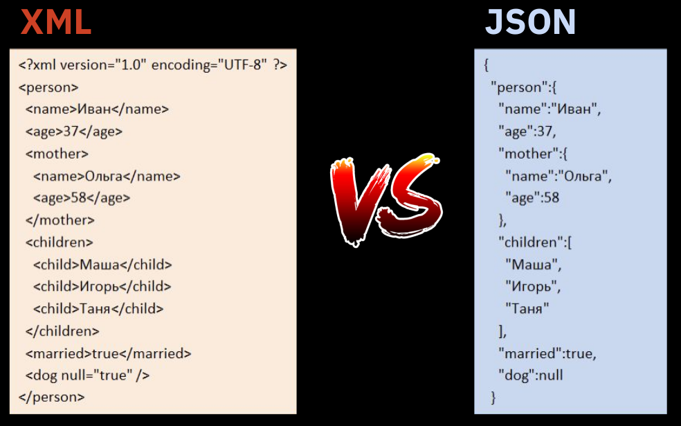

# **Урок 5. JSON и XML — основные форматы передачи данных**

## **Переписка с сервером**

SOAP и REST - это два стиля API.

**API** (*Application programming interface*) - это контракт, который предоставляет программа. «Ко мне можно обращаться так и так, я обязуюсь делать то и это».

Основные различия между SOAP и REST:

- **SOAP** (*Simple Object Access Protocol*) - стандартизированный протокол, который отправляет сообщения с использованием других протоколов, таких как HTTP и др. Более тяжеловесный, работает медленно.

- **REST** (*Representational State Transfer*) - это не протокол, а архитектурный стиль. Архитектура REST устанавливает набор рекомендаций, которым необходимо следовать. Более легковесный, работает быстро.

Для SOAP и REST-запросов используется два наиболее популярных формата передачи данных:

- **XML** - используется в SOAP (всегда) и REST-запросах (реже).
- **JSON** - используется в REST-запросах.

---

## **XML**

**XML** (*eXtensible Markup Language*) - расширяемый язык разметки. Используется для хранения и передачи данных. Так что увидеть его можно не только в API, но и в коде. Похож на HTML.

Структура XML:

```xml
<?xml version="1.0"?>     <!--Директива (заголовок). Не обязателен.-->
<bibliography>            <!--Корневой элемент. Обязателен.-->
    <book name="name">    <!--Информация по одной книге--><!--Так же могут использоваться атрибуты, необходимые для размещения дополнительной информации.--> 
        <title>Использование символа &amp; в гипертекстах</title>
        <author>Иванов И.И.</author>
        <keywords><![CDATA[символ,гипертекст,&]]></keywords>
    </book>
</bibliography>
```

```xml
<req>                                 // Корневой элемент. Обязателен.
    <query>мск сухонская 11</query>
    <count>7</count>
</req>
```

- ### **XSD-схема**

  **XSD** (*XML Schema Definition*) - это описание нашего XML.  
  Как он должен выглядеть, что в нем должно быть? Это ТЗ, написанное на языке машины.

  Если мы создаем SOAP-метод, то указываем в схеме:

    1. какие поля будут в запросе;
    2. какие поля будут в ответе;
    3. какие типы данных у каждого поля;
    4. какие поля обязательны для заполнения, а какие нет;
    5. есть ли у поля значение по умолчанию, и какое оно;
    6. есть ли у поля ограничение по длине;
    7. есть ли у поля другие параметры;
    8. какая у запроса структура по вложенности элементов;
    9. ...

  Пример: Метод `doRegister` в Users. Должны передать email, name и password для запроса.

    ```xml
    <wrap:doRegister>
        <emale>evgenii@mail.ru</emale>
        <name>Евгений</name>
        <password>12345</password>
    </wrap:doRegister>
    ```

  Пример: XSD-схема

    ```xsd
    <xs:element name="doRegister ">
        <xs:complexType>
        <xs:sequence>
            <xs:element name="email" type="xs:string"/>
            <xs:element name="name" type="xs:string"/>
            <xs:element name="password" type="xs:string"/>
        </xs:sequence>
        </xs:complexType>
    </xs:element>
    ```

- ### **Well Formed XML**

  Правила wel formed XML:

    1. Есть корневой каталог.
    2. У каждого элемента есть закрывающий тег.
    3. Теги регистрозависимые.
    4. Соблюдается правильная вложенность элементов.
    5. Атрибуты оформлены в кавычках.

## **JSON**

**JSON** (*JavaScript Object Notation*) - текстовый формат обмена данными, основанный на JavaScript. Но при этом формат независим от JS и может использоваться в любом языке программирования.

В SOAP API возможен только формат XML, а вот REST API поддерживает как XML, так и JSON. Разработчики предпочитают JSON - он легче читается человеком и меньше весит.

Объект заключен в фигурные скобки {}.  
JSON-объект — это неупорядоченное множество пар «ключ:значение».

Ключ - это название параметра, который мы передаем серверу. Он служит маркером для принимающей запрос системы: «смотри, здесь
у меня значение такого-то параметра!».

Структура JSON:

```json
{
    "query": "мск сухонская 11",
    "count": 7
}
```

- ### **Правила wel formed JSON**

    1. Данные написаны в виде пар "ключ: значение".
    2. Данные разделены запятыми.
    3. Объект находится внутри фигурных скобок {}.
    4. Массив - внутри квадратных скобок [].

---

  
JSON - это только формат данных, тогда как XML - это язык разметки.

---
[Вернуться назад](<Getting_to_know_the_Web.md>)