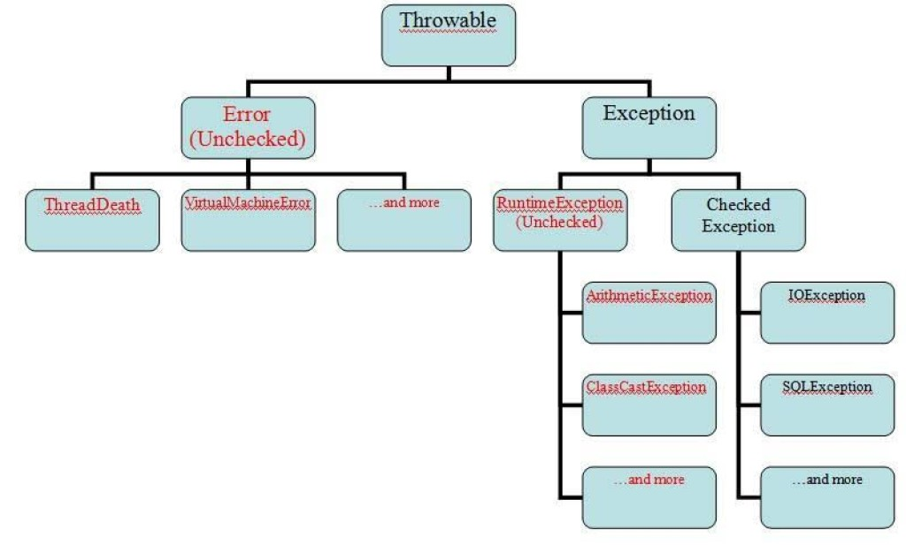

# Урок 1. Знакомство с Java

### [Стр 1. Типы данных. Классы обертки. Операции с данными. Массивы. Преобразование типов.](<Page_1.java>)

### [Стр 2. Получение данных: Scanner. Форматированный вывод. Область видимости переменных.](<Page_2.java>)

### [Стр 3. Функции и методы. Управляющие конструкции. Циклы.](<Page_3.java>)

### [Стр 4. Запись и чтение файлов. Обработка исключений.](<Page_4.java>)

---

### Иерархия исключений Java

---
[Вернуться назад](<../Introduction_to_Java.md>)