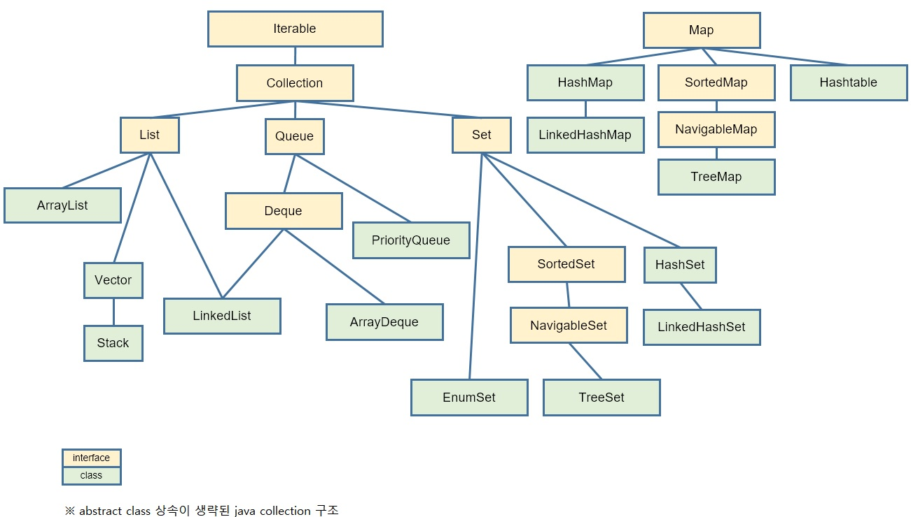

# Урок 3. Коллекции JAVA (введение)

### [Стр 1. Знакомство с Object.](<Page_1.java>)

### [Стр 2. Java Collections Framework.](<Page_2.java>)

### [Стр 3. Iterator ana Iterable.](<Page_3.java>)

### [Стр 4. Comparator ana Comparable.](<Page_4/ProgramClass.java>)

### [Стр 5. Stream API.](<Page_5.java>)

---

### Коллекции Java

---

[Вернуться назад](<../Introduction_to_Java.md>)